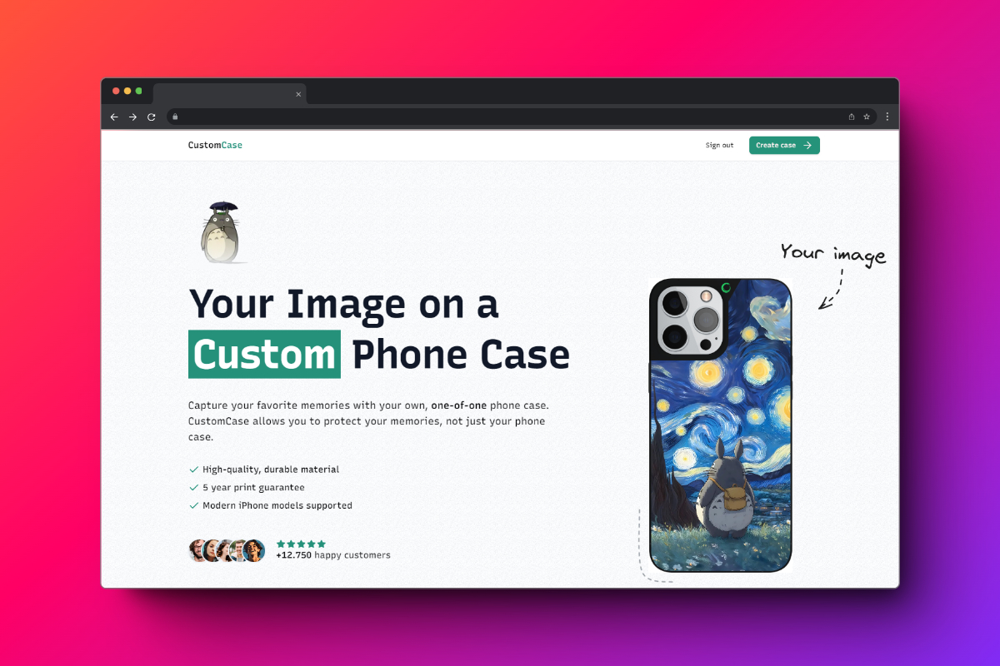

# Custom Case ✨📱


Custom Case is an e-commerce platform developed with Next.js for selling personalized phone cases. This application allows users to upload their photos, select their iPhone model, and choose case colors, offering a comprehensive solution for customized product sales with an optimized user experience.

## Features

- **User Registration and Authentication**: Seamless user registration, login, and logout powered by Kinde.
- **Photo Upload**: Users can upload images they want to print on their phone cases.
- **Product Customization**: Choose from various iPhone models and case colors.
- **Secure Payments**: Integrated with Stripe (in test mode) for handling payments securely.
- **Order Confirmation**: Automated email confirmation with order details upon successful purchase.

## Technologies Used

- **Next.js**: React framework for server-side rendering and generating static websites.
- **TypeScript**: Strongly typed programming language that builds on JavaScript.
- **Tailwind CSS**: Utility-first CSS framework for rapid UI development.
- **Zustand**: State management library for React.
- **Kinde**: Authentication service for user management.
- **Stripe**: Payment processing platform.
- **Node.js**: JavaScript runtime for server-side development.

## Getting Started

### Prerequisites

- npm or yarn
- Stripe account for testing payments
- Kinde account for authentication

### Installation

1. Clone the repository:

    ```bash
    git clone https://github.com/GabrielCastroV/customcase.git
    cd customcase
    ```

2. Install dependencies:

    ```bash
    npm install
    ```

3. Set up environment variables:

    Create a `.env` file in the root directory and add the following:

    ```env
    KINDE_CLIENT_ID=your_kinde_client_id
    KINDE_CLIENT_SECRET=your_kinde_client_secret
    KINDE_ISSUER_URL=your_kinde_url
    KINDE_SITE_URL=your_page_url
    KINDE_POST_LOGOUT_REDIRECT_URL=your_kinde_post_logout_redirect
    KINDE_POST_LOGIN_REDIRECT_URL=your_kinde_post_login_redirect/auth-callback

    NEXT_PUBLIC_SERVER_URL=your_next_public_server_url

    STRIPE_WEBHOOK_SECRET=your_secret_webhook_url
    STRIPE_SECRET_KEY=your_secret_stripe_key

    UPLOADTHING_SECRET=your_secret_key
    UPLOADTHING_APP_ID=your_secret_id

    DATABASE_URL=your_prisma_url

    ADMIN_EMAIL=your_email

    RESEND_API_KEY=your_secret_api_key
    ```

4. Run the development server:

    ```bash
    npm run dev
    ```

    Open [http://localhost:3000](http://localhost:3000) with your browser to see the result.

### Usage

1. **Register and Login**: Use Kinde for user authentication.
2. **Customize Case**: Upload your photo, select iPhone model and case color.
3. **Checkout**: Use Stripe for secure payment processing. (Use 4242 4242 4242 4242 card number for buying in test-mode)
4. **Order Confirmation**: Receive an email with order details.

## Contributing
Contributions are welcome! Please fork the repository and submit a pull request for any features, bug fixes, or improvements.

Fork the Project
1. Create your Feature Branch (git checkout -b feature/AmazingFeature)
2. Commit your Changes (git commit -m 'Add some AmazingFeature')
3. Push to the Branch (git push origin feature/AmazingFeature)
4. Open a Pull Request

